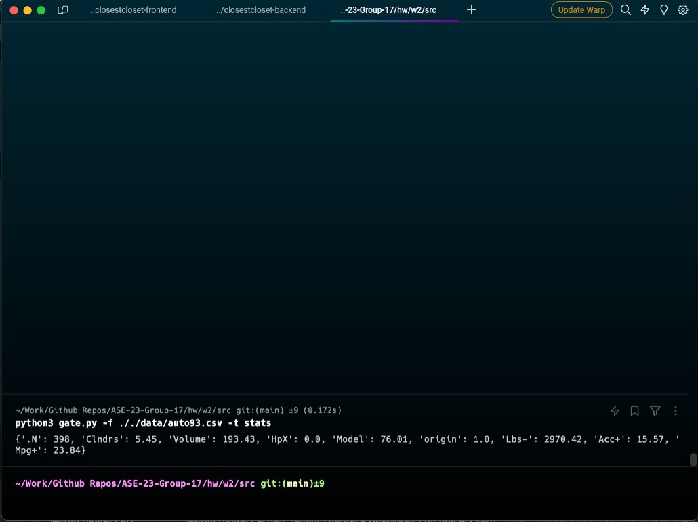
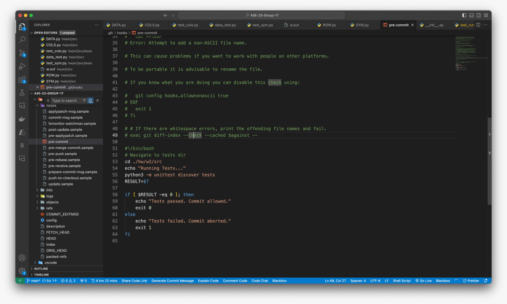
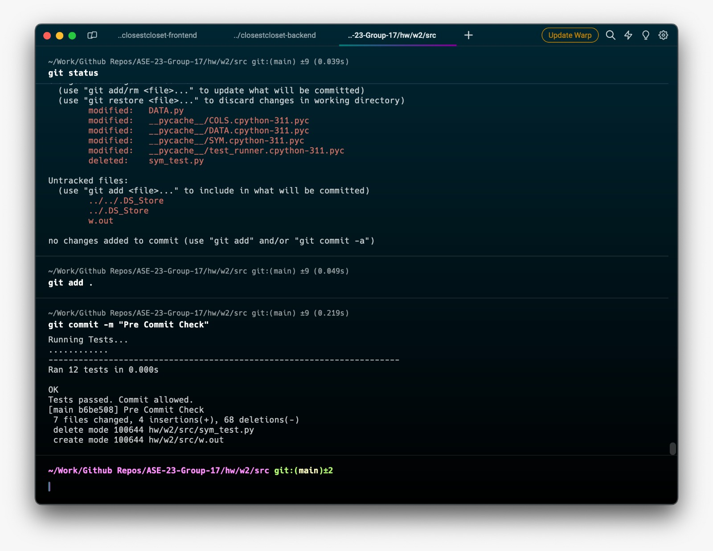

# Submission of Week 2 Homework

For this homework, stats were expected after getting NUM, SYM, COLS, DATA and ROW working.

Output: We got the classes working as expected.

Stats output:

We added pre-commit hook as was expect:

Pre-commit hook code:

Pre-commit hook execution:

