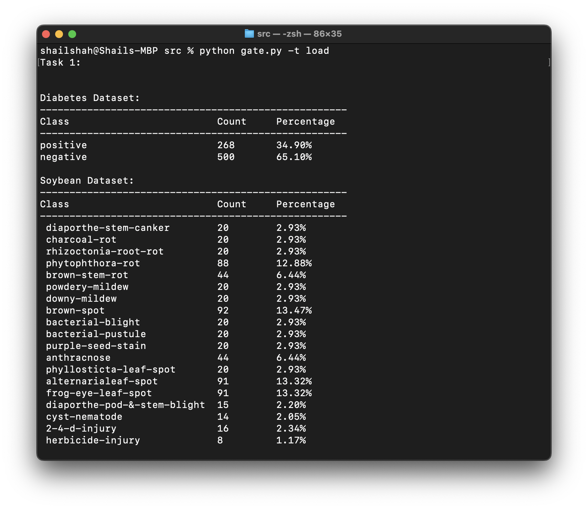
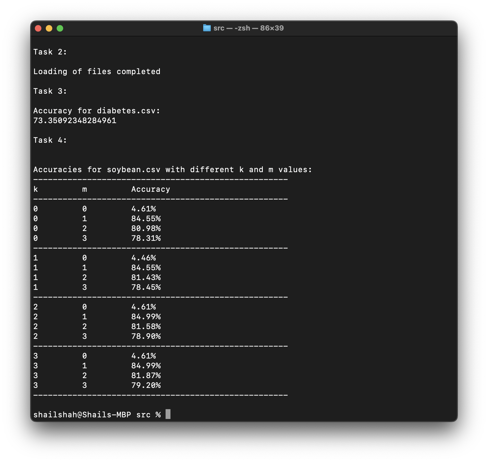

# Submission of Week 3 Homework

Task 1: 

We build the ASCII table as seen in the image above.

Task 2:

We build the Naive Bayes Classifier as per requirements:
- Implemented the like() method in the NUM, SYM and ROW class
- Implemented the likes() method in ROW class
- implemented the learn() method in load.py

Task 3:

After successfully implementing the classifier, we rank the test on diabetes to get an accuracy of 73.35092348284961%

Task 4:

We implemented the two loops that explore lower frequency settings and would like to present this analysis and recommendation:

When k=0 (no low class frequency kludge) and m=0 (no low attribute frequency kludge), the accuracy is very low at around 5%. This makes sense since with no smoothing, unseen classes and attributes will have 0 probability.
As m increases, the accuracy improves dramatically into the 80% range. This indicates that smoothing for low attribute frequencies is very helpful. The optimal m value seems to be 1 or 2.
Increasing k does not have much effect. Even k=3 shows similar accuracy to k=0 for a given m. This suggests low class frequencies are not an issue in this dataset.
The best accuracy is around 85% with k=0 or k=1 and m=1 or m=2.
For soybean, attributes are symbolic so m smoothing is critical. A value of m=1 or m=2 seems reasonable based on these results. The k value does not seem to matter much, so k=0 or k=1 is probably fine.
For this diabetes, smoothing low class and attribute frequencies does not help much. The data may not have enough low frequencies of classes or attributes to benefit from smoothing. The diabetes data attributes are purely numeric, spanning a wide range without sparse categorical values. Additionally, the two classes are balanced. Together, this means there are no low frequency regions needing smoothing. The numeric attributes form a naturally smooth distribution that can interpolate between observed values. So, artificially inflating probabilities of unseen values is unnecessary and harmful. Also, with no class imbalance, there is no need to smooth probabilities across classes.
In summary, we would recommend trying k=1, m=2 for both datasets based on these results. The soybean results show attributes matter more than classes, and the diabetes results may have more class imbalance. So a small amount of smoothing for both attributes and classes seems prudent.
